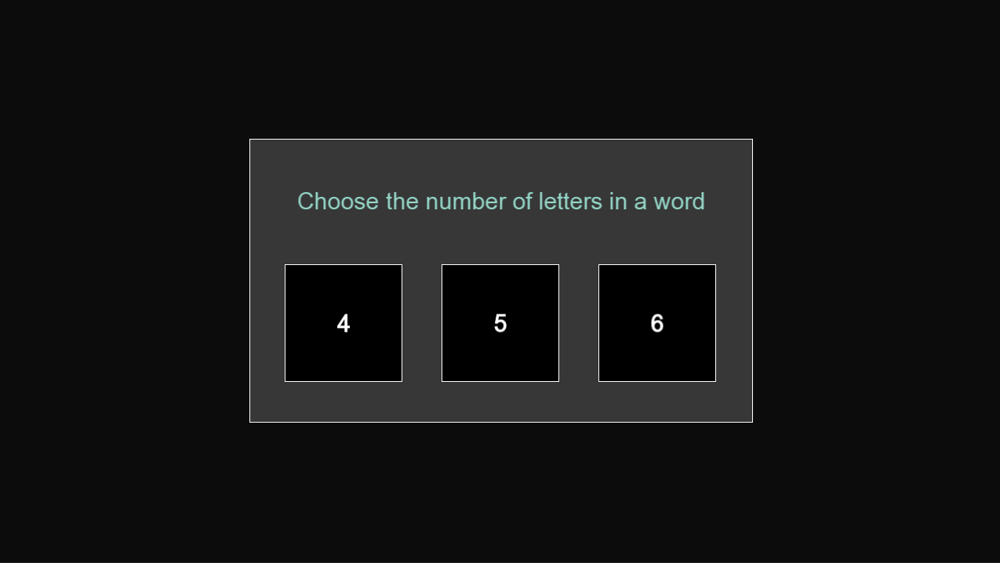
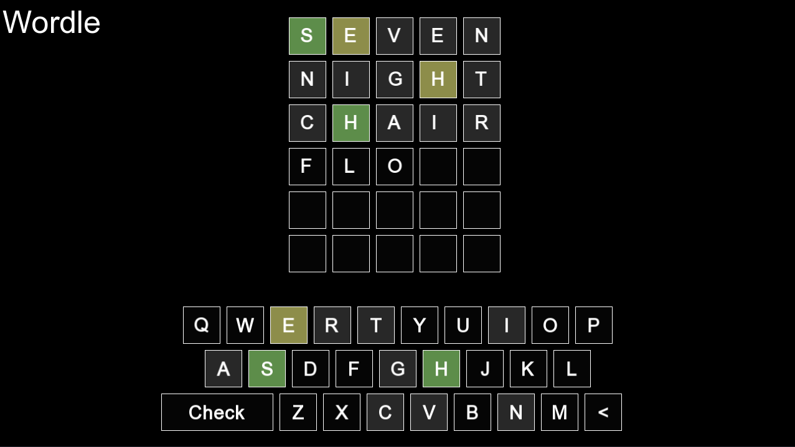
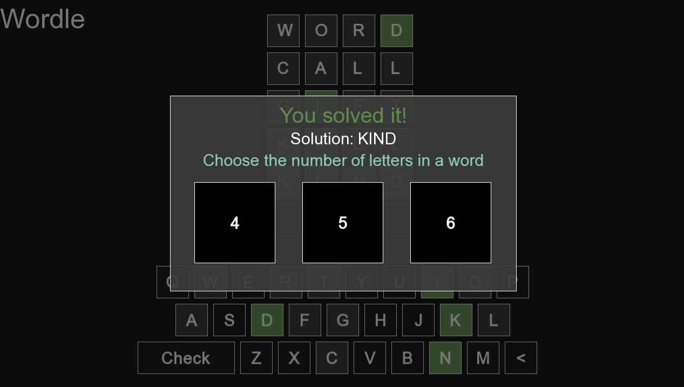

# Wordle

Wordle - популярная игра в слова
<br>Задача игрока - отгадать английское слово, загаданное компьютером

* База слов для проверки на валидность: https://wordnet.princeton.edu/

# Для компиляции требуется следующее:

* C++17 (или более поздняя)
* Система сборки для C++ (CMake)
* Boost.Beast (версия 1.88.0): https://www.boost.org/releases/latest/

## Установка и сборка

1. Склонируйте репозиторий:

   ```bash
   git clone https://github.com/TimurSaf/wordly.git
   ```

2. Соберите проект:

   ```bash
   mkdir build
   cmake ..
   cmake --build .
   ```

# Игровой процесс

При запуске вам будет предложен выбор количества букв в загадываемом слове - нажмите одну из кнопок, и вы сразу переместитесь в окно игрового процесса. Ввод слов осуществляется либо с помощью нажатия на кнопки с буквами внизу окна, либо с помощью клавиатуры. Вы также можете стереть буквы, щелкнув < или нажав клавишу Backspace. Когда вы введете полное слово, с помощью кнопки Check на экране или клавиши Enter вы сможете получить оценку вашего слова. В результате будет показан оттенок серого для букв, которые не должны появляться в решении, тускло-желтый, если буква есть где-то в слове, но не на этой позиции, и зеленый, если буква находится в правильном положении. У вас есть до 6 попыток, чтобы отгадать слово целиком.

Так выглядит игра сразу после её запуска:



Пример игрового процесса:



Пример финала игры:


